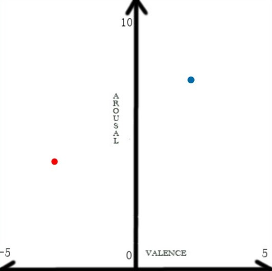

# MemoMusic-Dataset

#### Database of MemoMusic3.0 is a dataset of 180 piano music collected from the three categories of Classical, Pop, and Yanni, labeled with Valence and Arousal Information. Each category has 60 pieces of music.
#### Valence-Arousal(VA) model is a common emotional model.The lower value of arousal, the calmer the person's emotions, and vice versa. The higher value of valence, the more joyful people tend to be, and the opposite represents sadness.

1. File folder stores CSV files and txt files containing name, url, type(1 for classic, 2 for pop, 3 for Yanni), valence(in the range of [-5, 5]) and arousal(in the range of [0, 10]) information of each music.
2. MIDI folder stores MIDI files of our music, divided into three types(Classic, Pop and Yanni).
3. Mp3 folder stores Mp3 files of our music, divided into three types(Classic, Pop and Yanni).